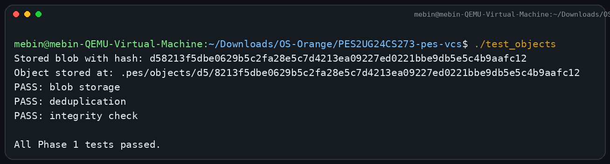
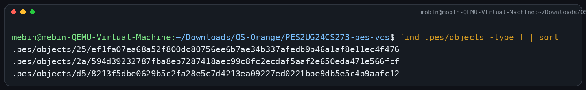
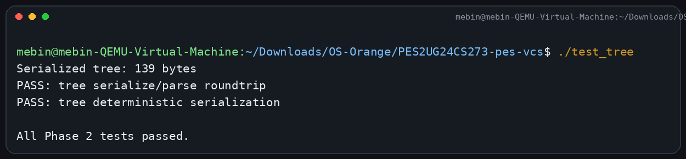
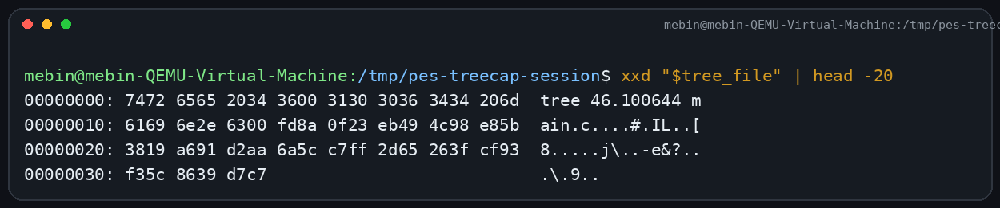
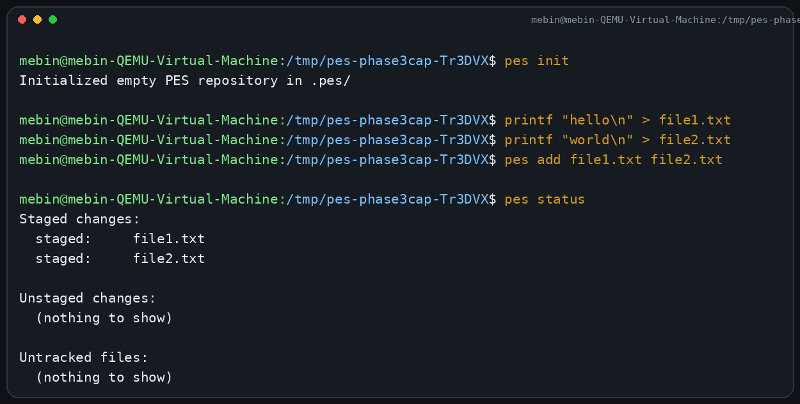
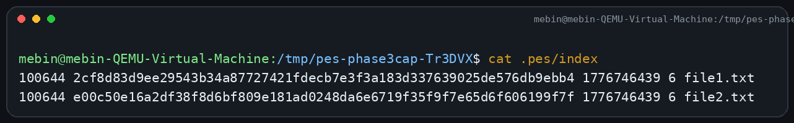
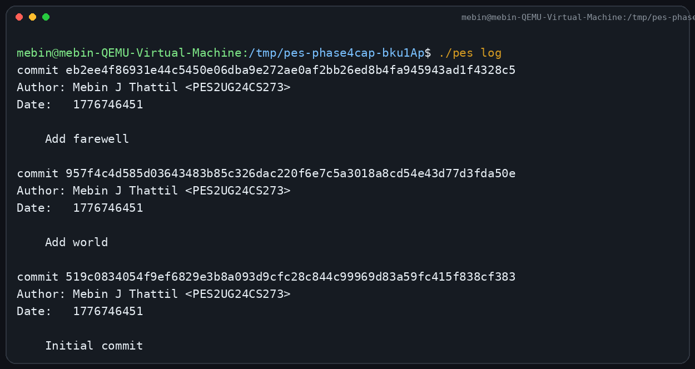
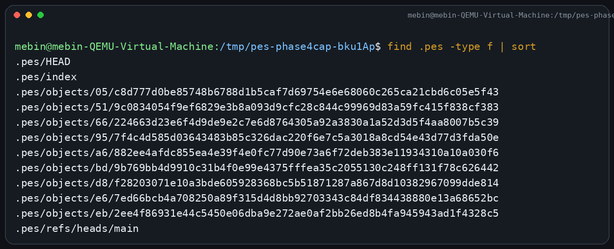
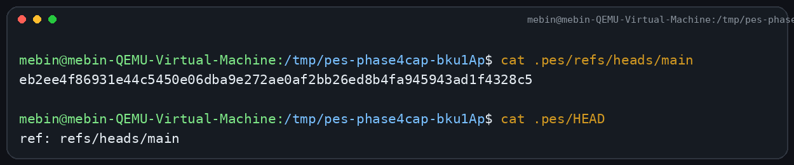
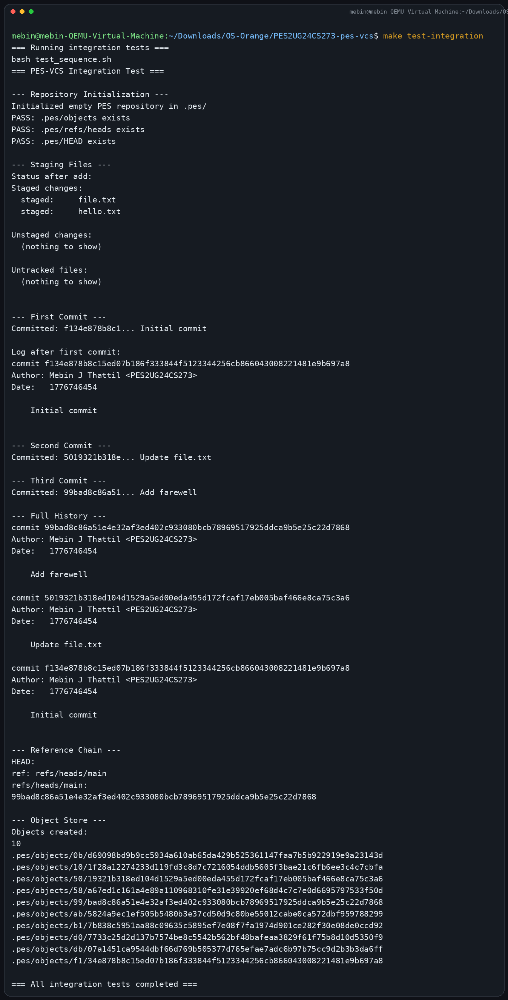

# PES-VCS Lab Report

**Name:** Mebin J Thattil  
**SRN:** PES2UG24CS273
**Repository:** https://github.com/mebinthattil/PES2UG24CS273-pes-vcs

## Overview

This report documents the implementation and verification of `PES-VCS`, a simplified local version control system built from the provided template repository. The required phases were completed by implementing:

- `object.c`: object storage and integrity verification
- `tree.c`: tree construction from the index
- `index.c`: staging area load/save/add operations
- `commit.c`: commit creation from the staged snapshot

The project was built with `make all`, verified with the provided unit tests, validated with manual command flows for Phases 3 and 4, and checked again with `make test-integration`.

## Phase 1

### Screenshot 1A: `./test_objects`

### Screenshot 1B: `find .pes/objects -type f`

## Phase 2

### Screenshot 2A: `./test_tree`

### Screenshot 2B: Raw tree object with `xxd`

## Phase 3

### Screenshot 3A: `pes init` -> `pes add` -> `pes status`

### Screenshot 3B: `.pes/index`

## Phase 4

### Screenshot 4A: `pes log`

### Screenshot 4B: `find .pes -type f | sort`

### Screenshot 4C: `cat .pes/refs/heads/main` and `cat .pes/HEAD`

## Final Integration Test

### `make test-integration`

## Analysis Answers

### Q5.1 Branching and Checkout

To implement `pes checkout <branch>`, the system would first resolve the target branch file at `.pes/refs/heads/<branch>` and read the commit hash stored in it. Then `HEAD` would be updated to `ref: refs/heads/<branch>` so future commits advance that branch. After that, the target commit would be read, its root tree would be traversed recursively, and the working directory would be rewritten to match that tree exactly. Existing tracked files that are not present in the target tree would need to be removed, files with changed blob hashes would need to be overwritten, executable bits would need to be restored from tree modes, and the index would need to be rewritten so it matches the checked-out snapshot.

The operation is complex because checkout affects both metadata and real filesystem contents. It is not just changing `HEAD`; it must safely replace the working directory, preserve permissions, handle nested directories, detect conflicts with local edits, and avoid partially switching the repository if an error happens midway through the process.

### Q5.2 Dirty Working Directory Conflict Detection

The index already stores each tracked file's path, blob hash, modification time, and size. To detect checkout conflicts, I would compare three states for every tracked path that differs between the current branch and the target branch:

1. The blob hash in the current `HEAD` tree.
2. The blob hash in the target branch's tree.
3. The current working-directory file compared against the index metadata and, when needed, the staged blob hash.

If the index says the file should have a specific size and `mtime`, but `stat()` on the working copy shows different metadata, that is a likely local edit and should trigger a deeper check by hashing the working copy and comparing it with the index's staged blob hash. If the working copy differs from the index, and the target branch also wants a different version of that same tracked path, checkout must refuse because switching would overwrite uncommitted user changes. This uses the index as the expected clean snapshot and the object store as the source of truth for the staged and committed contents.

### Q5.3 Detached HEAD

In detached HEAD state, `HEAD` contains a commit hash directly rather than a symbolic branch reference. New commits still work, but each new commit only updates `HEAD` itself, not any branch file in `.pes/refs/heads/`. That means the commits exist in the object store and remain reachable only through the temporary detached HEAD position.

If the user later checks out a normal branch, those detached commits can become unreachable unless a new branch or tag is created that points to them first. Recovery is possible as long as the commit hashes are still known and the objects have not been garbage-collected. A user could recover them by creating a new branch reference file containing the detached commit hash, or by manually setting `HEAD` or another ref back to that commit chain.

### Q6.1 Garbage Collection and Space Reclamation

The standard algorithm is a mark-and-sweep traversal:

1. Start from every live reference, such as all files under `.pes/refs/heads/` and possibly `HEAD` if it stores a detached commit hash.
2. For each referenced commit, mark that commit as reachable.
3. From each reachable commit, mark its tree and parent commit, then recursively walk every tree entry.
4. For each tree entry, mark the referenced blob or subtree.
5. After traversal, scan `.pes/objects/*/*` and delete any object whose hash is not in the reachable set.

The right data structure for the reachable set is a hash set keyed by object hash, because membership checks must be fast and repeated often. In a repository with 100,000 commits and 50 branches, the traversal would visit every commit reachable from those 50 tips, but shared history means the number of unique commits visited would still usually be close to the total history size, not 50 times larger. So a realistic upper bound is on the order of 100,000 commit objects plus the trees and blobs reachable from those commits. The exact count depends on repository size, but the key point is that each unique object is visited once if the reachable set is used correctly.

### Q6.2 GC Races with Concurrent Commits

Garbage collection is dangerous during a concurrent commit because a commit is created in stages. A new blob may be written first, then a tree that references it, then a commit that references the tree, and only at the end is the branch reference updated. If GC scans references during the gap before the branch file is updated, it may decide those freshly written objects are unreachable and delete them. The concurrent commit would then publish a ref to a commit whose tree or blobs are already missing, corrupting the repository.

Git avoids this kind of race by being conservative about object lifetime. Real Git uses additional references, reflogs, grace periods, and locking so that objects are not collected immediately after becoming temporarily unreachable. It also writes objects before updating refs atomically, and GC generally treats recently created loose objects as protected long enough that concurrent operations can finish publishing the references that make them reachable.
